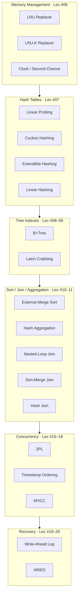

# Database Algorithms & Data Structures

A learning reference for the named algorithms, data structures, and techniques
taught in [CMU 15-445/645 Fall 2023](https://15445.courses.cs.cmu.edu/fall2023/schedule.html),
organized by lecture topic. Each entry: **what it is → how it works → where it
lands in turtle-db**.

Legend: `[x]` built in turtle-db · `[~]` partial · `[ ]` not started

---

## Map of algorithms → Roadmap phases

---

## Memory Management — Lecture #06

### LRU Replacer — `[x]`

- **What:** Evict the page that was Least Recently Used.
- **How:** Track access order (queue / linked list + map). On eviction, drop the
  oldest un-pinned frame.
- **turtle-db:** Built — `LRUReplacer` in the buffer pool.

### LRU-K Replacer — `[x]`

- **What:** Evict based on the **K-th most recent** access, not just the last one.
  Fixes LRU's weakness against sequential-flooding (a big scan touching each page
  once shouldn't evict hot pages).
- **How:** For each frame, remember timestamps of its last K references. **Backward
  k-distance** = time between _now_ and the K-th prior access; `+∞` if fewer than K
  accesses. Evict the frame with the largest backward k-distance; break ties among
  `+∞` frames using classic LRU (oldest single access).
- **Why it matters:** This is the CMU Project #1 replacer — it distinguishes
  frequently-used pages (small k-distance) from one-off scanned pages (`+∞`).
- **turtle-db:** Not started; would upgrade the current `LRUReplacer`.

### Clock / Second-Chance — `[ ]`

- **What:** LRU approximation using one reference bit per frame arranged in a ring.
- **How:** A "clock hand" sweeps frames; if `ref_bit == 1` clear it and skip
  (second chance), if `0` evict. Cheaper than true LRU (no per-access bookkeeping).

---

## Hash Tables — Lecture #07

### Linear Probing — `[ ]`

- **What:** Open-addressing hash table; on collision, scan forward to the next
  empty slot.
- **Gotcha:** Deletions need tombstones or shifting to avoid breaking probe chains.

### Cuckoo Hashing — `[ ]`

- **What:** Worst-case **O(1) lookups** using multiple hash tables/functions.
- **How:** Keep `d` hash functions (usually 2). On insert, place the key in any of
  its `d` candidate slots that is free. If all are full, **kick out** ("cuckoo") an
  existing occupant and re-insert _it_ using its other hash function; repeat. A
  lookup only checks `d` fixed slots → constant time.
- **Cycles:** If displacements loop, rebuild with new hash functions / larger table.
- **Why it matters:** Reads never probe long chains — great for read-heavy indexes.
- **turtle-db:** Not started; candidate for the hash-index bucket scheme.

### Extendible Hashing — `[ ]`

- **What:** Dynamic hashing that grows **without full rehashing** by splitting one
  bucket at a time.
- **How:** A **directory** indexed by the top _global-depth_ bits of the hash points
  to buckets, each with a _local depth_. On overflow, split just that bucket and bump
  its local depth; only **double the directory** when a split needs a local depth
  greater than the global depth. Multiple directory entries can share one bucket.
- **Why it matters:** This is the CMU Project #2 hash index.
- **turtle-db:** Not started — Roadmap Phase 4 "Extendible/linear Hash Index".

### Linear Hashing — `[ ]`

- **What:** Grow incrementally using a **split pointer** instead of a directory.
- **How:** Split the bucket at the pointer on overflow (regardless of _which_ bucket
  overflowed), advancing the pointer round-robin; use two hash functions to route
  keys before/after the split. Overflow chains absorb pressure between splits.

---

## Tree Indexes — Lectures #08–09

### B+Tree — `[ ]`

- **What:** Balanced, high-fan-out search tree; the workhorse index for **range**
  scans and point lookups.
- **How:** All values live in **leaf nodes** linked in a sorted doubly-linked list;
  inner nodes hold only routing keys. Nodes are ~half-to-full; **insert** splits a
  full node and pushes a separator up, **delete** merges/redistributes underflowing
  nodes. Height stays `O(log_fanout n)`; a node = one page.
- **B+Tree vs B-Tree:** B+Tree keeps data only in leaves (better range scans, denser
  inner nodes); B-Tree stores values in inner nodes too.
- **turtle-db:** Not started — CMU Project #2; Roadmap Phase 4.

### Latch Crabbing / Coupling — `[ ]`

- **What:** Thread-safe concurrent B+Tree traversal.
- **How:** Acquire the child's latch **before** releasing the parent's ("crab" down).
  Release ancestor latches once the child is proven **safe** — a node that can't
  split on insert (not full) or merge on delete (more than half-full). Readers take
  shared latches; writers take exclusive and can shed them early via the safe test.
- **turtle-db:** Not started — Roadmap notes it comes _after_ Phase 5 (concurrency).

---

## Sorting & Aggregations — Lecture #10

### External Merge Sort — `[ ]`

- **What:** Sort data **larger than memory** using bounded buffer pool pages.
- **How:** **Pass 0** — read `B` pages at a time, sort each in memory, write sorted
  _runs_. **Merge passes** — `(B−1)`-way merge of runs into longer runs until one
  remains. Cost ≈ `2N · (1 + ⌈log_{B−1}⌉(N/B))` page I/Os.
- **turtle-db:** Not started — backs `SortExecutor` (ORDER BY).

### Hash Aggregation — `[ ]`

- **What:** Compute GROUP BY / COUNT / SUM / MIN / MAX / AVG via a hash table keyed
  by group.
- **How:** Probe/insert each tuple into a hash table of running aggregates; spill
  partitions to disk if the table exceeds memory.
- **turtle-db:** Not started — backs `AggregateExecutor`.

---

## Join Algorithms — Lecture #11

### Nested-Loop Join — `[ ]`

- **Simple:** for each outer tuple, scan the whole inner relation — `O(M·N)`.
- **Block:** buffer a chunk of the outer relation to amortize inner scans.
- **Index:** probe an index on the inner join key instead of scanning.
- **turtle-db:** Roadmap's first join — `NestedLoopJoinExecutor` (INNER first).

### Sort-Merge Join — `[ ]`

- **What:** Sort both inputs on the join key, then merge in one linear pass.
- **Best when:** inputs are already sorted or output must be sorted.

### Hash Join — `[ ]`

- **What:** Equi-join via a hash table.
- **How:** **Build** a hash table on the smaller relation's join key, then **probe**
  it with the larger relation. **Grace / partitioned** hash join spills both inputs
  into matching partitions first when they don't fit in memory.
- **turtle-db:** Not started — `HashJoinExecutor`.

---

## Concurrency Control — Lectures #15–18

### Two-Phase Locking (2PL) — `[ ]`

- **What:** Lock-based protocol guaranteeing **serializability**.
- **How:** Each txn has a **growing phase** (only acquires locks) then a **shrinking
  phase** (only releases). **Strict 2PL** holds all exclusive locks until
  commit/abort → avoids cascading aborts. Needs **deadlock** handling: detection
  (wait-for graph) or prevention (wait-die / wound-wait).
- **turtle-db:** Not started — the Lock Manager (CMU Project #4).

### Timestamp Ordering (T/O) — `[ ]`

- **What:** Order txns by timestamps instead of locks.
- **How:** Each object tracks last read/write timestamps; a txn that arrives "too
  late" is aborted and restarted. **Basic T/O** and **OCC** (validate at commit) are
  the two flavors.

### Multi-Version Concurrency Control (MVCC) — `[ ]`

- **What:** Writers create **new versions** instead of overwriting, so readers never
  block writers (and vice-versa).
- **How:** Each row has a **version chain**; a txn reads the version visible to its
  snapshot. Needs **garbage collection** of dead versions. Used by Postgres, MySQL
  InnoDB, etc.
- **turtle-db:** Not started — Roadmap Phase 5 "version chains, garbage collection".

---

## Logging & Recovery — Lectures #19–20

### Write-Ahead Logging (WAL) — `[ ]`

- **What:** Durability rule — **log the change before** writing the data page.
- **How:** Append redo/undo records tagged with **LSNs**; flush log up to a page's
  LSN before that page hits disk (**force-log-at-commit** + **steal/no-force**
  buffer policy).

### ARIES — `[ ]`

- **What:** The canonical crash-recovery algorithm (IBM). Three phases:
  1. **Analysis** — scan from last checkpoint to rebuild the dirty-page & active-txn
     tables.
  2. **Redo** — replay history from the earliest dirty-page LSN (repeat _all_ actions,
     even uncommitted).
  3. **Undo** — roll back losers using **CLRs** (compensation log records) so undo is
     itself idempotent/restartable.
- **Key ideas:** WAL, repeating history, logging undo progress via CLRs.
- **turtle-db:** Not started — Roadmap Phase 6.

---

## Quick reference table

| Algorithm           | Lecture | Category          | turtle-db | Roadmap   |
| ------------------- | ------- | ----------------- | --------- | --------- |
| LRU Replacer        | #06     | Eviction          | `[x]`     | Phase 1   |
| LRU-K Replacer      | #06     | Eviction          | `[x]`     | Phase 1   |
| Cuckoo Hashing      | #07     | Hash table        | `[ ]`     | Phase 4   |
| Extendible Hashing  | #07     | Hash index        | `[ ]`     | Phase 4   |
| Linear Hashing      | #07     | Hash index        | `[ ]`     | Phase 4   |
| B+Tree              | #08     | Tree index        | `[ ]`     | Phase 4   |
| Latch Crabbing      | #09     | Index concurrency | `[ ]`     | Phase 4/5 |
| External Merge Sort | #10     | Sorting           | `[ ]`     | Phase 3   |
| Hash Aggregation    | #10     | Aggregation       | `[ ]`     | Phase 3   |
| Nested-Loop Join    | #11     | Join              | `[ ]`     | Phase 3   |
| Sort-Merge Join     | #11     | Join              | `[ ]`     | Phase 3   |
| Hash Join           | #11     | Join              | `[ ]`     | Phase 3   |
| 2PL                 | #16     | Concurrency       | `[ ]`     | Phase 5   |
| Timestamp Ordering  | #17     | Concurrency       | `[ ]`     | Phase 5   |
| MVCC                | #18     | Concurrency       | `[ ]`     | Phase 5   |
| Write-Ahead Log     | #19     | Recovery          | `[ ]`     | Phase 6   |
| ARIES               | #20     | Recovery          | `[ ]`     | Phase 6   |
